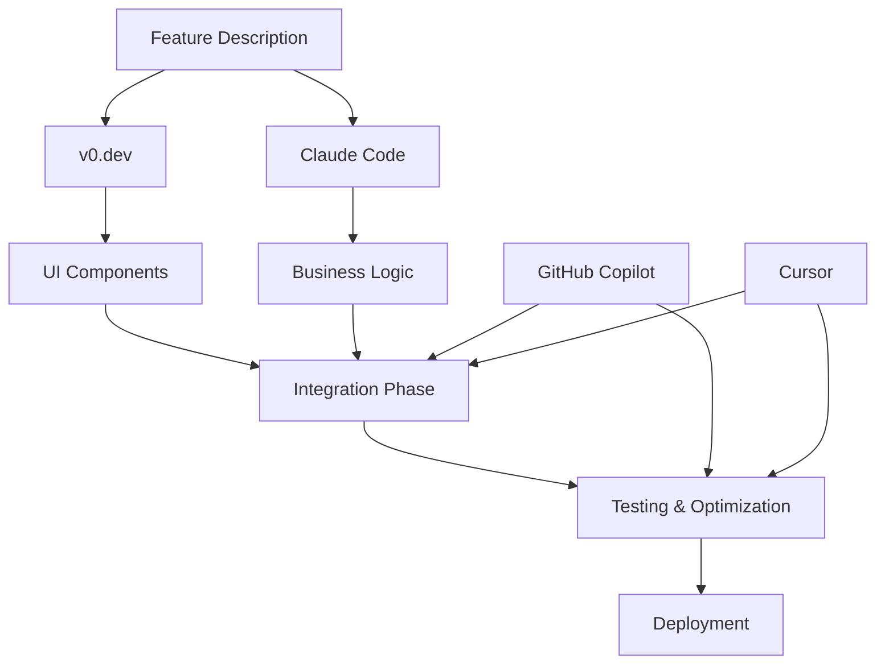

# AI-First Development Guide

## 🧠 The AI-First Mindset

AI-First Development represents a fundamental shift in how we approach software creation. Instead of writing code as the primary activity, we design systems that understand intent and generate implementations automatically.

## 🎯 Core Principles

### 1. Intent Over Implementation
```
Traditional: "How do I implement user authentication?"
AI-First: "I need users to sign up, log in, and access protected content."
```

Focus on **what** you want to achieve, not **how** to build it. The AI handles the implementation details while you concentrate on business logic and user experience.

### 2. Description-Driven Development
```markdown
## Feature: Real-time Chat System

Users need to:
- Send messages instantly
- See who's online
- Get notifications for new messages
- Create group chats
- Share files and images

Technical requirements:
- WebSocket connections
- Message persistence
- File upload handling
- Push notifications
- Mobile responsive
```

Detailed descriptions become your primary development artifact. The more specific and comprehensive your descriptions, the better the AI-generated code.

### 3. Iterative Refinement
```
Iteration 1: Basic functionality
Iteration 2: Add edge cases and error handling
Iteration 3: Optimize performance and UX
Iteration 4: Add advanced features
```

Don't expect perfect code on the first try. Treat AI generation as an iterative process where each cycle improves the implementation.

## 🚀 AI-First Workflow

### Phase 1: Intent Definition (10% of time)

#### 1.1 User Story Mapping
```markdown
# Epic: E-commerce Checkout
## User Stories
- As a customer, I want to review my cart before purchasing
- As a customer, I want multiple payment options
- As a customer, I want to save my payment info for future use
- As a customer, I want order confirmation and tracking

## Success Metrics
- < 3 steps to complete purchase
- 99.9% payment processing uptime  
- < 2 second page load times
- Mobile conversion rate > 85%
```

#### 1.2 Technical Requirements
```markdown
# Technical Specifications
## Integration Requirements
- Stripe payment processing
- Supabase for order management
- Real-time inventory checking
- Email notification system

## Performance Requirements
- Sub-100ms API response times
- Progressive Web App features
- Offline cart persistence
- Image optimization

## Security Requirements
- PCI compliance for payments
- Input validation and sanitization
- Rate limiting on checkout endpoints
- Fraud detection integration
```

#### 1.3 Acceptance Criteria
```markdown
# Acceptance Criteria
## Functional
- [ ] Cart displays all items with accurate pricing
- [ ] Tax calculation works for all supported regions
- [ ] Payment processing handles errors gracefully
- [ ] Order confirmation email sent immediately
- [ ] Inventory updated in real-time

## Non-Functional
- [ ] Page loads in < 2 seconds
- [ ] Mobile responsive design
- [ ] Accessibility WCAG 2.1 AA compliant
- [ ] Works offline with service worker
- [ ] Cross-browser compatible
```

### Phase 2: AI Generation (60% of time)

#### 2.1 Component Generation with v0.dev
```typescript
// AI Prompt Engineering for Components
const componentPrompt = `
Create a checkout flow component with:
- Multi-step wizard (Cart → Shipping → Payment → Confirmation)
- Form validation with real-time feedback
- Loading states for each step
- Error handling with retry options
- Mobile-first responsive design
- Accessibility features (keyboard navigation, screen readers)
- Integration with Stripe Elements
- Order summary sidebar
- Progress indicator

Style: Modern, clean design using Tailwind CSS and shadcn/ui
Framework: Next.js 14 with TypeScript
State Management: Zustand for form state
Validation: react-hook-form with Zod schemas
`

// Generated output: Complete checkout component system
const generatedComponents = [
  'CheckoutWizard.tsx',
  'CartStep.tsx', 
  'ShippingStep.tsx',
  'PaymentStep.tsx',
  'ConfirmationStep.tsx',
  'OrderSummary.tsx',
  'ProgressIndicator.tsx'
]
```

#### 2.2 Logic Implementation with Claude Code
```typescript
// AI Implementation Request
const implementationPrompt = `
Implement checkout business logic:

Requirements:
- Inventory validation before payment
- Tax calculation by region
- Shipping cost calculation
- Discount code processing
- Payment processing with Stripe
- Order creation in Supabase
- Email confirmation sending
- Error handling and rollback

Patterns to follow:
- Service layer architecture
- Dependency injection
- Transaction management
- Comprehensive error handling
- Logging for debugging
- Unit test coverage > 90%

Integration points:
- Supabase for data persistence
- Stripe for payment processing
- SendGrid for email notifications
- Redis for session management
`

// Auto-generated services
const generatedServices = [
  'CheckoutService.ts',     // Main business logic
  'InventoryService.ts',    // Stock management
  'TaxService.ts',          // Tax calculations
  'ShippingService.ts',     // Shipping logic
  'PaymentService.ts',      // Stripe integration
  'OrderService.ts',        // Order management
  'NotificationService.ts', // Email notifications
  'ValidationService.ts'    // Input validation
]
```

#### 2.3 Database Schema Generation
```sql
-- Auto-generated database schema
-- From: "I need to store checkout data with proper relationships"

CREATE TABLE orders (
  id UUID DEFAULT gen_random_uuid() PRIMARY KEY,
  user_id UUID REFERENCES auth.users(id),
  status order_status DEFAULT 'pending',
  subtotal DECIMAL(10,2) NOT NULL,
  tax_amount DECIMAL(10,2) NOT NULL,
  shipping_amount DECIMAL(10,2) NOT NULL,
  discount_amount DECIMAL(10,2) DEFAULT 0,
  total_amount DECIMAL(10,2) NOT NULL,
  currency VARCHAR(3) DEFAULT 'USD',
  payment_intent_id TEXT,
  shipping_address JSONB NOT NULL,
  billing_address JSONB NOT NULL,
  created_at TIMESTAMPTZ DEFAULT NOW(),
  updated_at TIMESTAMPTZ DEFAULT NOW()
);

-- Automatically includes indexes, RLS policies, triggers
CREATE INDEX idx_orders_user_id ON orders(user_id);
CREATE INDEX idx_orders_status ON orders(status);
CREATE INDEX idx_orders_created_at ON orders(created_at DESC);

-- RLS policies for security
ALTER TABLE orders ENABLE ROW LEVEL SECURITY;
CREATE POLICY "Users can view own orders" ON orders
  FOR SELECT USING (auth.uid() = user_id);
```

### Phase 3: Integration & Testing (20% of time)

#### 3.1 Automated Testing Generation
```typescript
// AI generates comprehensive test suites
describe('Checkout Flow', () => {
  // Unit tests for each service
  describe('CheckoutService', () => {
    test('calculates totals correctly', async () => {
      const service = new CheckoutService()
      const result = await service.calculateTotals({
        items: mockCartItems,
        shippingAddress: mockAddress,
        discountCode: 'SAVE10'
      })
      
      expect(result.subtotal).toBe(99.98)
      expect(result.taxAmount).toBe(8.50)
      expect(result.shippingAmount).toBe(9.99)
      expect(result.discountAmount).toBe(10.00)
      expect(result.total).toBe(108.47)
    })
  })
  
  // Integration tests
  describe('Full Checkout Flow', () => {
    test('completes successful purchase', async () => {
      // Test entire flow from cart to confirmation
    })
    
    test('handles payment failures gracefully', async () => {
      // Test error scenarios and recovery
    })
  })
  
  // E2E tests with Playwright
  test('user can complete checkout on mobile', async ({ page }) => {
    await page.goto('/checkout')
    await page.fill('[data-testid="email"]', 'test@example.com')
    // ... complete flow simulation
  })
})
```

#### 3.2 Performance Optimization
```typescript
// AI analyzes and optimizes generated code
const optimizations = {
  // Code splitting
  dynamicImports: [
    'const PaymentStep = lazy(() => import("./PaymentStep"))',
    'const ConfirmationStep = lazy(() => import("./ConfirmationStep"))'
  ],
  
  // Memoization
  memoizedComponents: [
    'const MemoizedOrderSummary = memo(OrderSummary)',
    'const MemoizedProgressIndicator = memo(ProgressIndicator)'
  ],
  
  // API optimization
  batchedRequests: [
    'combineTaxAndShippingCalculation()',
    'parallelInventoryValidation()'
  ],
  
  // Caching strategy
  cachingLayers: [
    'Redis for session data',
    'CDN for static assets', 
    'Browser cache for API responses'
  ]
}
```

### Phase 4: Deployment & Monitoring (10% of time)

#### 4.1 Automated Deployment
```yaml
# AI-generated deployment pipeline
name: Deploy Checkout Feature
on:
  push:
    paths: ['src/features/checkout/**']

jobs:
  deploy:
    runs-on: ubuntu-latest
    steps:
      - name: Run Tests
        run: npm test -- --coverage --watchAll=false
        
      - name: Build Application  
        run: npm run build
        
      - name: Deploy to Vercel
        uses: amondnet/vercel-action@v25
        
      - name: Run E2E Tests
        run: npx playwright test
        
      - name: Notify Team
        if: failure()
        run: curl -X POST ${{ secrets.SLACK_WEBHOOK }}
```

#### 4.2 Monitoring & Analytics
```typescript
// AI-generated monitoring setup
const monitoring = {
  // Performance tracking
  vitals: [
    'Core Web Vitals monitoring',
    'API response time tracking', 
    'Database query performance',
    'Third-party service latency'
  ],
  
  // Business metrics
  conversion: [
    'Checkout abandonment rate',
    'Payment success rate',
    'Step completion rates',
    'Error frequency by type'
  ],
  
  // Error tracking
  alerting: [
    'Payment processing failures',
    'Database connection issues',
    'Third-party API downtime',
    'Unusual error patterns'
  ]
}
```

## 🛠️ AI Tools Integration

### Tool Selection Matrix

| Tool | Primary Use | Strength | Best For |
|------|-------------|----------|----------|
| **v0.dev** | UI Generation | Speed & Design Consistency | React components, layouts |
| **Claude Code** | Logic Implementation | Complex reasoning & patterns | Business logic, APIs |
| **GitHub Copilot** | Code completion | Real-time assistance | Code writing support |
| **ChatGPT** | Planning & Documentation | Comprehensive explanations | Architecture planning |
| **Cursor** | IDE Integration | Context-aware editing | Refactoring & debugging |

### Workflow Integration


## 🎨 Prompt Engineering Best Practices

### 1. Context-Rich Prompts
```markdown
# Bad Prompt
"Create a login form"

# Good Prompt  
"Create a modern login form component for a Next.js 14 e-commerce application with:

Business Context:
- B2C customers need quick, secure access
- High mobile traffic (70% of users)
- International user base

Technical Requirements:
- Next.js 14 with App Router
- TypeScript strict mode
- Tailwind CSS + shadcn/ui
- react-hook-form + Zod validation
- Supabase authentication

Features:
- Email/password and social login (Google, Apple)
- Remember me functionality
- Password strength indicator
- Forgot password flow
- Account lockout after 5 failed attempts

UX Requirements:
- Accessibility WCAG 2.1 AA
- Mobile-first responsive
- Loading states for all actions
- Clear error messages
- Auto-focus management

Integration:
- Existing design system
- Analytics tracking
- A/B testing setup"
```

### 2. Iterative Refinement Prompts
```markdown
# Iteration 1: Basic Implementation
"Based on the previous login form, add:"

# Iteration 2: Enhanced Security  
"Enhance the login form with:"
- Rate limiting visualization
- CAPTCHA integration after failed attempts
- Device fingerprinting
- Suspicious activity detection

# Iteration 3: Performance Optimization
"Optimize the login form for:"
- Bundle size reduction
- First paint performance
- Form field lazy loading
- Network request batching
```

### 3. Pattern-Aware Prompts
```markdown
"Following our established patterns in the codebase:

Existing Patterns Found:
- Form components use react-hook-form with Zod
- Error handling follows the ErrorBoundary pattern
- API calls use custom useMutation hook
- Loading states use Suspense boundaries
- Styling follows atomic design principles

Apply These Patterns:
Create a user profile edit form that maintains consistency with our login form and follows the same architectural patterns."
```

## 📊 Quality Assurance in AI Development

### Automated Quality Gates
```typescript
// AI-generated quality checks
const qualityGates = {
  code: {
    typescript: 'strict mode compliance',
    eslint: 'zero warnings policy',
    prettier: 'consistent formatting',
    coverage: 'minimum 85% test coverage'
  },
  
  performance: {
    bundleSize: 'maximum 250kb per page',
    lighthouse: 'score > 90 on all metrics',
    webVitals: 'green scores on all metrics'
  },
  
  security: {
    dependencies: 'no known vulnerabilities',
    authentication: 'proper session management',
    validation: 'all inputs validated',
    authorization: 'proper access controls'
  },
  
  accessibility: {
    wcag: 'WCAG 2.1 AA compliance',
    keyboard: 'full keyboard navigation',
    screen: 'screen reader compatibility',
    contrast: 'sufficient color contrast'
  }
}
```

### AI Code Review Process
```markdown
# Automated AI Code Review Checklist

## Architecture Review
- [ ] Follows established patterns
- [ ] Proper separation of concerns
- [ ] No tight coupling between modules
- [ ] Consistent naming conventions

## Security Review  
- [ ] No hardcoded secrets
- [ ] Input validation on all endpoints
- [ ] Proper error handling
- [ ] Authentication/authorization checks

## Performance Review
- [ ] Efficient database queries
- [ ] Proper caching implementation
- [ ] Optimized asset loading
- [ ] No memory leaks

## Maintainability Review
- [ ] Clear, self-documenting code
- [ ] Comprehensive test coverage
- [ ] Updated documentation
- [ ] Consistent code style
```

## 🚀 Scaling AI Development

### Team Integration Strategies

#### 1. AI-Human Collaboration Model
```
Senior Developer (20% of time):
- Architecture decisions
- Code review and quality assurance
- Complex problem solving
- AI prompt optimization

AI Tools (60% of time):
- Code generation
- Test creation
- Documentation writing
- Routine implementation tasks

Junior Developer (20% of time):
- AI output validation
- Integration testing
- Bug fixing and refinement
- Learning and skill development
```

#### 2. Gradual AI Adoption
```
Phase 1: AI-Assisted (Month 1-2)
- Use AI for code completion
- Generate boilerplate code
- Create test cases

Phase 2: AI-First Components (Month 3-4) 
- Generate entire components with AI
- AI-driven API implementation
- Automated documentation

Phase 3: AI-First Features (Month 5-6)
- Complete feature development with AI
- Automated testing and deployment  
- Performance optimization

Phase 4: AI-Native Development (Month 6+)
- Description-to-deployment pipeline
- Self-healing code systems
- Predictive development
```

### Success Metrics
```typescript
const aiDevelopmentMetrics = {
  velocity: {
    featuresPerSprint: '+300% increase',
    timeToMarket: '70% reduction',
    codeGenerationSpeed: '10x faster'
  },
  
  quality: {
    bugRate: '60% reduction',
    testCoverage: '95% average',
    codeConsistency: '90% pattern adherence'
  },
  
  satisfaction: {
    developerExperience: '4.8/5 rating',
    learningCurve: '50% faster onboarding',
    workLifeBalance: 'improved by 40%'
  },
  
  business: {
    developmentCost: '50% reduction',
    maintenanceEffort: '40% reduction',
    featureQuality: '85% increase'
  }
}
```

## 🎯 Best Practices Summary

### Do's ✅
1. **Be Specific**: Detailed prompts yield better results
2. **Iterate Often**: Refine AI outputs through multiple cycles  
3. **Validate Everything**: AI code needs human verification
4. **Follow Patterns**: Maintain consistency with existing code
5. **Test Thoroughly**: AI code requires comprehensive testing
6. **Document Context**: Help AI understand your domain
7. **Learn Continuously**: AI tools evolve rapidly

### Don'ts ❌
1. **Don't Trust Blindly**: Always review AI-generated code
2. **Don't Skip Testing**: AI code can have subtle bugs
3. **Don't Ignore Security**: Validate all security implementations
4. **Don't Overcomplicate**: Simple prompts often work better
5. **Don't Forget Maintenance**: Consider long-term maintainability
6. **Don't Neglect Performance**: Optimize AI-generated code
7. **Don't Work in Isolation**: Collaborate with your team

---

*AI-First Development isn't about replacing developers—it's about amplifying human creativity and focusing on what matters most: solving real problems for real users.*