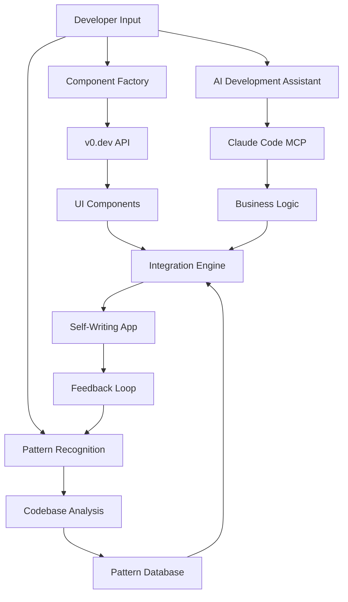
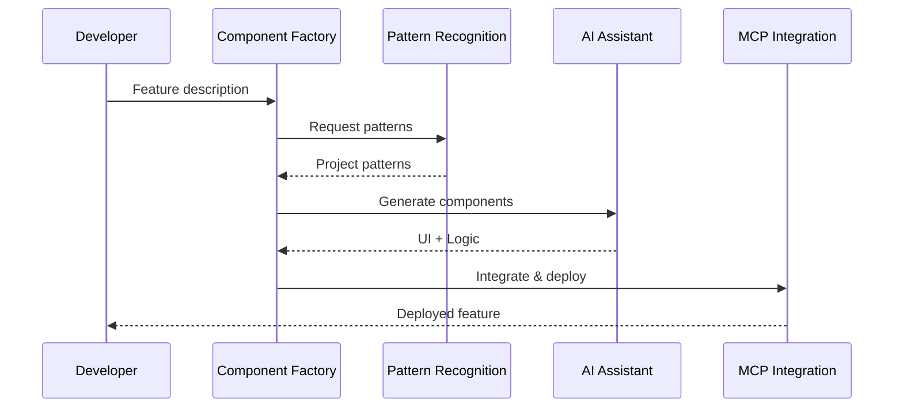

# Self-Writing Apps Architecture

## 🏗️ Architektura Systemu

Self-Writing Apps to ekosystem składający się z czterech głównych komponentów, które współpracują ze sobą w celu automatycznego generowania i ewoluowania kodu aplikacji.



## 🎯 Core Components

### 1. Component Factory

**Cel:** Automatyczne generowanie komponentów UI z opisów w języku naturalnym.

#### Architektura:
```typescript
interface ComponentFactory {
  // Input processing
  parseDescription(description: string): ComponentSpec
  extractRequirements(spec: ComponentSpec): Requirements
  
  // Generation
  generateComponent(requirements: Requirements): Component
  optimizeForFramework(component: Component, framework: Framework): Component
  
  // Integration
  integrateWithProject(component: Component, project: Project): void
  updateDependencies(project: Project): void
}
```

#### Workflow:
1. **Input Analysis**: Parsowanie opisu funkcjonalności
2. **Requirement Extraction**: Wyciągnięcie technical requirements
3. **v0.dev Integration**: Generowanie komponentów przez v0.dev
4. **Framework Optimization**: Dostosowanie do Next.js/React patterns
5. **Project Integration**: Automatyczne dodanie do projektu

#### Przykład:
```
Input: "Komponent produktu z obrazem, nazwą, ceną i przyciskiem dodaj do koszyka"

Generated:
- ProductCard.tsx
- ProductCard.module.css
- ProductCard.test.tsx
- Storybook stories
- TypeScript interfaces
```

### 2. Pattern Recognition System

**Cel:** Analiza istniejącego kodu i automatyczne stosowanie wzorców projektowych.

#### Architektura:
```typescript
interface PatternRecognition {
  // Analysis
  analyzeCodebase(path: string): CodebaseAnalysis
  identifyPatterns(analysis: CodebaseAnalysis): Pattern[]
  
  // Learning
  learnFromUsage(patterns: Pattern[], usage: UsageData): void
  updatePatternDatabase(patterns: Pattern[]): void
  
  // Application
  applyPatterns(code: Code, patterns: Pattern[]): Code
  suggestImprovements(code: Code): Improvement[]
}
```

#### Detected Patterns:
- **Component Patterns**: Jak tworzone są komponenty w projekcie
- **State Management**: Redux, Zustand, lub React Context patterns
- **API Integration**: Fetch patterns, error handling
- **Styling**: Tailwind classes, CSS modules usage
- **File Structure**: Organizacja folderów i plików

#### Pattern Database:
```typescript
interface Pattern {
  id: string
  name: string
  category: 'component' | 'api' | 'state' | 'styling' | 'structure'
  confidence: number
  template: string
  examples: CodeExample[]
  metadata: {
    framework: string
    lastUsed: Date
    frequency: number
  }
}
```

### 3. AI Development Assistant

**Cel:** Implementacja logiki biznesowej, refaktoryzacje i code review.

#### Claude Code MCP Integration:
```typescript
interface AIAssistant {
  // Code Generation
  generateBusinessLogic(requirements: Requirements): Code
  implementAPI(schema: APISchema): APIImplementation
  
  // Code Quality
  reviewCode(code: Code): CodeReview
  refactorCode(code: Code, improvements: Improvement[]): Code
  
  // Testing
  generateTests(code: Code): TestSuite
  validateImplementation(code: Code, requirements: Requirements): ValidationResult
}
```

#### Capabilities:
- **Logic Implementation**: Tworzenie złożonej logiki biznesowej
- **API Development**: Generowanie endpoints i integracji
- **Database Operations**: CRUD operations, migrations
- **Error Handling**: Comprehensive error management
- **Performance Optimization**: Code optimization suggestions

### 4. MCP Integration Layer

**Cel:** Bezpośrednie połączenie z narzędziami developerskimi i automatyzacja procesów.

#### Architektura:
```typescript
interface MCPIntegration {
  // Tool Connections
  connectToVSCode(): VSCodeConnection
  connectToGit(): GitConnection
  connectToVercel(): VercelConnection
  
  // Automation
  automate(workflow: Workflow): Promise<Result>
  monitor(project: Project): Metrics
  
  // Deployment
  deploy(project: Project, target: DeploymentTarget): Promise<Deployment>
  rollback(deployment: Deployment): Promise<void>
}
```

#### Connected Tools:
- **VS Code**: Direct file manipulation, debugging
- **Git**: Automated commits, branch management
- **Vercel**: Deployment automation
- **Supabase**: Database schema management
- **Testing Frameworks**: Jest, Playwright automation

## 🔄 System Workflow

### 1. Input Processing
```typescript
// Developer input
const request = "Dashboard sprzedażowy z wykresami i tabelą zamówień"

// Pattern recognition
const patterns = await patternRecognition.analyzeProject()
const requirements = await componentFactory.parseDescription(request, patterns)
```

### 2. Component Generation
```typescript
// v0.dev integration
const uiComponents = await v0dev.generateComponents(requirements.ui)

// Business logic
const businessLogic = await claude.generateLogic(requirements.logic)

// Integration
const integratedCode = await integrationEngine.combine(uiComponents, businessLogic)
```

### 3. Quality Assurance
```typescript
// Code review
const review = await claude.reviewCode(integratedCode)

// Testing
const tests = await claude.generateTests(integratedCode)

// Validation
const validation = await validate(integratedCode, requirements)
```

### 4. Deployment
```typescript
// MCP automation
await mcp.automate({
  commit: true,
  test: true,
  deploy: true,
  notify: true
})
```

## 📊 Data Flow

### Input → Processing → Output



## 🧠 Learning System

### Pattern Evolution
```typescript
interface LearningSystem {
  // Usage tracking
  trackUsage(pattern: Pattern, context: Context): void
  
  // Pattern evolution
  evolvePatterns(usage: UsageData[]): Pattern[]
  
  // Recommendation engine
  recommendPatterns(context: Context): Pattern[]
  
  // Quality metrics
  measureSuccess(pattern: Pattern, outcome: Outcome): QualityScore
}
```

### Feedback Loops:
- **Usage Analytics**: Które patterns są używane najczęściej
- **Error Tracking**: Które generacje wymagają poprawek
- **Performance Metrics**: Wpływ na wydajność aplikacji
- **Developer Satisfaction**: Feedback od zespołu

## 🔧 Technical Stack

### Core Technologies:
- **v0.dev API**: UI component generation
- **Claude Code**: Business logic implementation
- **MCP Protocol**: Tool integration
- **TypeScript**: Type safety across the system
- **Node.js**: Runtime environment

### Databases:
- **Pattern Database**: SQLite/PostgreSQL for pattern storage
- **Usage Analytics**: ClickHouse for metrics
- **Project Metadata**: JSON files in project root

### Integration Points:
- **VS Code Extensions**: Real-time code manipulation
- **GitHub Actions**: CI/CD automation
- **Vercel API**: Deployment management
- **Supabase SDK**: Database operations

---

*Architecture designed for scalability, maintainability, and continuous evolution.*