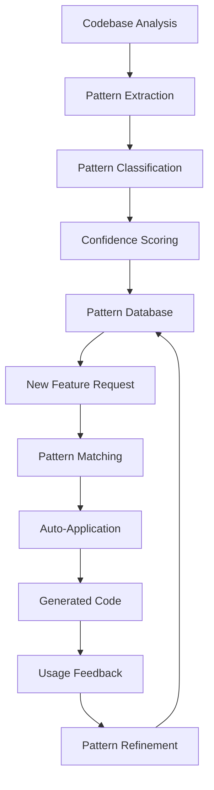

# Auto-Evolving Patterns

## 🧬 Pattern Evolution System

Self-Writing Apps wykorzystują inteligentny system rozpoznawania i ewolucji wzorców, który uczy się z każdego projektu i automatycznie stosuje najlepsze praktyki.

## 🔍 Pattern Recognition

### How It Works

System analizuje istniejący kod w projekcie, identyfikuje wzorce i automatycznie je stosuje w nowych komponentach.



### Pattern Categories

#### 1. Component Patterns
```typescript
interface ComponentPattern {
  id: string
  name: string
  category: 'component'
  confidence: number
  template: {
    structure: string
    props: PropPattern[]
    hooks: HookPattern[]
    styling: StylingPattern
  }
  examples: string[]
  usage: {
    frequency: number
    lastUsed: Date
    successRate: number
  }
}

// Detected pattern example
const cardPattern: ComponentPattern = {
  id: 'card-component',
  name: 'Standard Card Component',
  category: 'component',
  confidence: 0.95,
  template: {
    structure: `
      interface {name}Props {
        title: string
        children: React.ReactNode
        className?: string
      }
      
      export function {name}({ title, children, className }: {name}Props) {
        return (
          <div className={cn("card", className)}>
            <div className="card-header">
              <h3 className="card-title">{title}</h3>
            </div>
            <div className="card-content">
              {children}
            </div>
          </div>
        )
      }
    `,
    props: [
      { name: 'title', type: 'string', required: true },
      { name: 'children', type: 'React.ReactNode', required: true },
      { name: 'className', type: 'string', required: false }
    ],
    hooks: [],
    styling: {
      system: 'tailwind',
      classes: ['card', 'card-header', 'card-title', 'card-content'],
      responsive: true
    }
  },
  examples: [
    'components/ProductCard.tsx',
    'components/UserCard.tsx', 
    'components/DashboardCard.tsx'
  ],
  usage: {
    frequency: 15,
    lastUsed: new Date(),
    successRate: 0.93
  }
}
```

#### 2. API Patterns
```typescript
const apiPattern: APIPattern = {
  id: 'supabase-crud',
  name: 'Supabase CRUD Operations',
  category: 'api',
  confidence: 0.91,
  template: {
    structure: `
      export class {Entity}Service {
        private supabase = createClientComponentClient()
        
        async getAll(): Promise<{Entity}[]> {
          const { data, error } = await this.supabase
            .from('{table}')
            .select('*')
          
          if (error) throw new Error(error.message)
          return data || []
        }
        
        async getById(id: string): Promise<{Entity} | null> {
          const { data, error } = await this.supabase
            .from('{table}')
            .select('*')
            .eq('id', id)
            .single()
            
          if (error) throw new Error(error.message)
          return data
        }
        
        async create(item: Create{Entity}): Promise<{Entity}> {
          const { data, error } = await this.supabase
            .from('{table}')
            .insert(item)
            .select()
            .single()
            
          if (error) throw new Error(error.message)
          return data
        }
        
        async update(id: string, updates: Update{Entity}): Promise<{Entity}> {
          const { data, error } = await this.supabase
            .from('{table}')
            .update(updates)
            .eq('id', id)
            .select()
            .single()
            
          if (error) throw new Error(error.message)
          return data
        }
        
        async delete(id: string): Promise<void> {
          const { error } = await this.supabase
            .from('{table}')
            .delete()
            .eq('id', id)
            
          if (error) throw new Error(error.message)
        }
      }
    `,
    errorHandling: 'throw-error',
    authentication: 'supabase-auth',
    validation: 'typescript'
  }
}
```

#### 3. State Management Patterns
```typescript
const statePattern: StatePattern = {
  id: 'zustand-store',
  name: 'Zustand Store with Async Actions',
  category: 'state',
  confidence: 0.88,
  template: {
    structure: `
      interface {Entity}Store {
        // State
        {entity}s: {Entity}[]
        loading: boolean
        error: string | null
        
        // Actions
        set{Entity}s: ({entity}s: {Entity}[]) => void
        add{Entity}: ({entity}: {Entity}) => void
        update{Entity}: (id: string, updates: Partial<{Entity}>) => void
        remove{Entity}: (id: string) => void
        
        // Async actions
        fetch{Entity}s: () => Promise<void>
        create{Entity}: (data: Create{Entity}) => Promise<void>
        update{Entity}Async: (id: string, updates: Update{Entity}) => Promise<void>
        delete{Entity}: (id: string) => Promise<void>
        
        // Reset
        reset: () => void
      }
      
      export const use{Entity}Store = create<{Entity}Store>((set, get) => ({
        // Initial state
        {entity}s: [],
        loading: false,
        error: null,
        
        // Sync actions
        set{Entity}s: ({entity}s) => set({ {entity}s }),
        add{Entity}: ({entity}) => set(state => ({ 
          {entity}s: [...state.{entity}s, {entity}] 
        })),
        update{Entity}: (id, updates) => set(state => ({
          {entity}s: state.{entity}s.map({entity} => 
            {entity}.id === id ? { ...{entity}, ...updates } : {entity}
          )
        })),
        remove{Entity}: (id) => set(state => ({
          {entity}s: state.{entity}s.filter({entity} => {entity}.id !== id)
        })),
        
        // Async actions
        fetch{Entity}s: async () => {
          set({ loading: true, error: null })
          try {
            const {entity}s = await {entity}Service.getAll()
            set({ {entity}s, loading: false })
          } catch (error) {
            set({ error: error.message, loading: false })
          }
        },
        
        create{Entity}: async (data) => {
          set({ loading: true, error: null })
          try {
            const new{Entity} = await {entity}Service.create(data)
            set(state => ({ 
              {entity}s: [...state.{entity}s, new{Entity}], 
              loading: false 
            }))
          } catch (error) {
            set({ error: error.message, loading: false })
          }
        },
        
        // ... other async actions
        
        reset: () => set({
          {entity}s: [],
          loading: false,
          error: null
        })
      }))
    `
  }
}
```

#### 4. Styling Patterns
```typescript
const stylingPattern: StylingPattern = {
  id: 'tailwind-component',
  name: 'Tailwind with CSS Variables',
  category: 'styling',
  confidence: 0.94,
  template: {
    approach: 'tailwind + css-variables',
    structure: `
      import { cn } from '@/lib/utils'
      import { cva, type VariantProps } from 'class-variance-authority'
      
      const {component}Variants = cva(
        // Base styles
        "base-class-here",
        {
          variants: {
            variant: {
              default: "variant-classes-here",
              secondary: "secondary-classes-here",
              destructive: "destructive-classes-here"
            },
            size: {
              default: "size-classes-here",
              sm: "small-classes-here",
              lg: "large-classes-here"
            }
          },
          defaultVariants: {
            variant: "default",
            size: "default"
          }
        }
      )
      
      interface {Component}Props 
        extends React.HTMLAttributes<HTMLDivElement>,
        VariantProps<typeof {component}Variants> {
        // Additional props
      }
      
      export function {Component}({ 
        className, 
        variant, 
        size, 
        ...props 
      }: {Component}Props) {
        return (
          <div 
            className={cn({component}Variants({ variant, size, className }))}
            {...props}
          />
        )
      }
    `,
    conventions: [
      'Use cn() utility for className merging',
      'Implement variants with cva',
      'Extend HTML attributes',
      'Forward refs when needed'
    ]
  }
}
```

#### 5. File Structure Patterns
```typescript
const structurePattern: StructurePattern = {
  id: 'feature-folder',
  name: 'Feature-based Folder Structure',
  category: 'structure',
  confidence: 0.89,
  template: {
    structure: `
      src/
      ├── app/                    # Next.js app directory
      ├── components/             # Shared components
      │   ├── ui/                # shadcn/ui components
      │   └── {feature}/         # Feature-specific components
      ├── features/              # Feature modules
      │   └── {feature}/
      │       ├── components/    # Feature components
      │       ├── hooks/         # Feature hooks
      │       ├── services/      # Feature services
      │       ├── types/         # Feature types
      │       └── utils/         # Feature utilities
      ├── lib/                   # Shared utilities
      ├── hooks/                 # Shared hooks
      └── types/                 # Shared types
    `,
    conventions: [
      'Group by feature, not by file type',
      'Keep shared code in top-level folders',
      'Co-locate related files',
      'Use index files for clean imports'
    ]
  }
}
```

## 🤖 Pattern Learning System

### Learning Algorithm
```typescript
interface PatternLearner {
  analyzeCode(filePaths: string[]): Pattern[]
  extractPatterns(ast: AST): Pattern[]
  scoreConfidence(pattern: Pattern, context: CodeContext): number
  refinePattern(pattern: Pattern, feedback: Feedback): Pattern
}

class PatternLearningEngine {
  private patterns: Map<string, Pattern> = new Map()
  
  async learnFromProject(projectPath: string) {
    // 1. Analyze all files
    const files = await this.scanProjectFiles(projectPath)
    
    // 2. Extract patterns
    for (const file of files) {
      const ast = await this.parseFile(file)
      const patterns = await this.extractPatterns(ast, file)
      
      // 3. Update pattern database
      for (const pattern of patterns) {
        await this.updatePattern(pattern)
      }
    }
    
    // 4. Calculate confidence scores
    await this.recalculateConfidences()
  }
  
  private async updatePattern(newPattern: Pattern) {
    const existing = this.patterns.get(newPattern.id)
    
    if (existing) {
      // Merge and strengthen pattern
      const merged = await this.mergePatterns(existing, newPattern)
      this.patterns.set(newPattern.id, merged)
    } else {
      // Add new pattern
      this.patterns.set(newPattern.id, newPattern)
    }
  }
}
```

### Pattern Application
```typescript
interface PatternApplicator {
  findRelevantPatterns(context: GenerationContext): Pattern[]
  applyPattern(pattern: Pattern, context: GenerationContext): string
  customizePattern(pattern: Pattern, requirements: Requirements): Pattern
}

class SmartPatternApplicator {
  async generateCode(request: CodeRequest): Promise<GeneratedCode> {
    // 1. Find relevant patterns
    const relevantPatterns = await this.findPatterns(request.context)
    
    // 2. Select best pattern
    const bestPattern = this.selectBestPattern(relevantPatterns, request)
    
    // 3. Customize pattern
    const customized = await this.customizePattern(bestPattern, request)
    
    // 4. Generate code
    const code = await this.applyPattern(customized, request.context)
    
    // 5. Track usage
    await this.trackUsage(bestPattern, request, code)
    
    return code
  }
  
  private selectBestPattern(patterns: Pattern[], request: CodeRequest): Pattern {
    return patterns
      .map(pattern => ({
        pattern,
        score: this.calculateRelevanceScore(pattern, request)
      }))
      .sort((a, b) => b.score - a.score)[0]?.pattern
  }
}
```

## 📊 Pattern Analytics

### Usage Metrics
```typescript
interface PatternMetrics {
  patternId: string
  usage: {
    totalUses: number
    successRate: number
    lastUsed: Date
    averageGenerationTime: number
  }
  feedback: {
    positive: number
    negative: number
    modifications: number
  }
  evolution: {
    version: number
    changes: Change[]
    stability: number
  }
}

// Real-time metrics dashboard
const metrics = {
  mostUsedPatterns: [
    { name: 'Card Component', usage: 45, success: 0.94 },
    { name: 'Supabase CRUD', usage: 32, success: 0.91 },
    { name: 'Zustand Store', usage: 28, success: 0.89 }
  ],
  patternEvolution: {
    thisWeek: 12,
    improved: 8,
    deprecated: 2,
    new: 3
  },
  qualityTrends: {
    confidence: '+5%',
    successRate: '+8%',
    generationSpeed: '+15%'
  }
}
```

### Pattern Quality Assessment
```typescript
interface QualityAssessment {
  consistency: number      // How consistent with project style
  performance: number      // Performance impact
  maintainability: number  // Code maintainability score
  testability: number      // How testable the pattern is
  accessibility: number    // Accessibility compliance
  security: number         // Security best practices
}

const assessPattern = async (pattern: Pattern): Promise<QualityAssessment> => {
  return {
    consistency: await analyzeConsistency(pattern),
    performance: await analyzePerformance(pattern),
    maintainability: await analyzeMaintainability(pattern),
    testability: await analyzeTestability(pattern),
    accessibility: await analyzeAccessibility(pattern),
    security: await analyzeSecurity(pattern)
  }
}
```

## 🎯 Pattern Customization

### Dynamic Pattern Modification
```typescript
interface PatternCustomizer {
  adaptToProject(pattern: Pattern, projectContext: ProjectContext): Pattern
  incorporateFeedback(pattern: Pattern, feedback: UserFeedback): Pattern
  optimizeForFramework(pattern: Pattern, framework: Framework): Pattern
}

// Example: Adapting card pattern for different projects
const adaptCardPattern = (pattern: ComponentPattern, context: ProjectContext) => {
  const adapted = { ...pattern }
  
  // Adapt styling approach
  if (context.styling === 'styled-components') {
    adapted.template.styling = {
      system: 'styled-components',
      approach: 'css-in-js'
    }
  }
  
  // Adapt state management
  if (context.stateManagement === 'redux') {
    adapted.template.hooks = [
      ...adapted.template.hooks,
      { name: 'useSelector', from: 'react-redux' },
      { name: 'useDispatch', from: 'react-redux' }
    ]
  }
  
  return adapted
}
```

### A/B Testing Patterns
```typescript
interface PatternTester {
  createVariant(pattern: Pattern): Pattern
  runTest(original: Pattern, variant: Pattern, context: TestContext): TestResult
  selectWinner(results: TestResult[]): Pattern
}

// Automatic A/B testing of pattern improvements
const testPatternVariants = async (pattern: Pattern) => {
  // Create variant with optimization
  const variant = await optimizePattern(pattern)
  
  // Test both versions
  const originalResult = await testPattern(pattern, testCases)
  const variantResult = await testPattern(variant, testCases)
  
  // Select winner based on metrics
  if (variantResult.score > originalResult.score) {
    await promotePattern(variant)
    return variant
  }
  
  return pattern
}
```

## 🚀 Future Evolution

### Self-Improving Patterns
```typescript
interface EvolutionEngine {
  predictOptimalPattern(context: GenerationContext): Pattern
  generatePatternVariations(basePattern: Pattern): Pattern[]
  evolveBasedOnIndustryTrends(patterns: Pattern[]): Pattern[]
}

// Patterns that improve themselves
const selfEvolvingPattern = {
  basePattern: cardPattern,
  evolutionRules: [
    'optimize for current React version',
    'incorporate latest accessibility standards', 
    'adapt to performance best practices',
    'integrate with trending libraries'
  ],
  learningRate: 0.1,
  adaptationThreshold: 0.8
}
```

### Industry Pattern Integration
```typescript
// Automatically learn from open source projects
const industryLearner = {
  sources: [
    'github.com/trending',
    'popular-react-patterns',
    'nextjs-examples',
    'tailwindui-patterns'
  ],
  frequency: 'weekly',
  integration: 'automatic',
  validation: 'community-consensus'
}
```

## 📈 Success Stories

### Pattern Evolution Examples

#### 1. Form Pattern Evolution
```
V1: Basic form with useState
  ↓ Learned from project usage
V2: Added form validation
  ↓ Integrated react-hook-form
V3: Added accessibility features
  ↓ Optimized for mobile
V4: Current version with full UX optimization
```

#### 2. API Pattern Evolution
```
V1: Basic fetch with error handling
  ↓ Learned Supabase patterns
V2: Supabase-specific patterns
  ↓ Added caching layer
V3: Optimistic updates
  ↓ Real-time subscriptions
V4: Full real-time API with offline support
```

---

*Patterns that learn, adapt, and evolve - the future of consistent, high-quality code generation.*