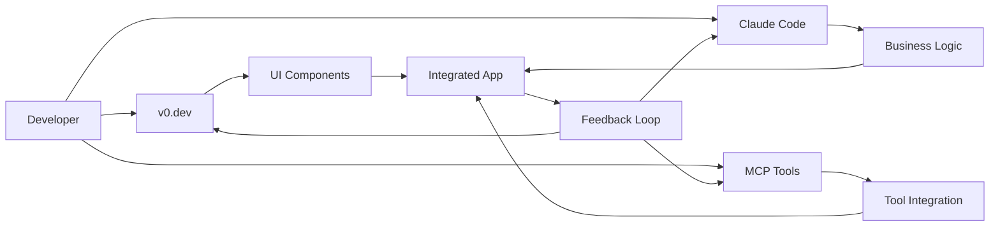

# Tools Integration: v0.dev + Claude Code + MCP

## 🛠️ Ecosystem Overview

Self-Writing Apps opierają się na trzech kluczowych narzędziach AI, które współpracują ze sobą w celu automatyzacji procesu tworzenia aplikacji.



## 🎨 v0.dev Integration

### Component Generation Engine

v0.dev służy jako główny generator komponentów UI, przekształcając opisy w języku naturalnym w gotowe komponenty React.

#### Setup & Configuration
```typescript
// v0-config.json
{
  "apiKey": "${V0_API_KEY}",
  "framework": "nextjs",
  "styling": {
    "library": "tailwindcss",
    "components": "shadcn/ui"
  },
  "preferences": {
    "typescript": true,
    "responsive": true,
    "accessibility": "wcag-2.1",
    "testing": true
  },
  "patterns": {
    "loadFromProject": true,
    "applyAutomatically": true
  }
}
```

#### API Integration
```typescript
interface V0DevAPI {
  generateComponent(params: ComponentRequest): Promise<GeneratedComponent>
  refineComponent(component: Component, feedback: string): Promise<Component>
  generateVariants(component: Component): Promise<Component[]>
}

// Usage example
const dashboardComponent = await v0.generateComponent({
  prompt: "Dashboard with sidebar navigation, main content area, and user profile dropdown",
  style: "modern",
  responsive: true,
  framework: "nextjs",
  components: ["sidebar", "header", "main", "dropdown"]
})
```

#### Generated Output Structure
```
components/
├── Dashboard/
│   ├── index.tsx           # Main component
│   ├── Sidebar.tsx         # Navigation sidebar
│   ├── Header.tsx          # Top header with user menu
│   ├── MainContent.tsx     # Content area
│   └── types.ts            # TypeScript definitions
├── ui/                     # Shared UI components
│   ├── Button.tsx
│   ├── Card.tsx
│   └── Dropdown.tsx
└── __tests__/
    └── Dashboard.test.tsx   # Component tests
```

#### Advanced Features

**1. Pattern Recognition**
```typescript
// v0.dev learns from your existing components
const existingPatterns = await v0.analyzeProject('./src/components')
const newComponent = await v0.generateComponent({
  prompt: "User settings form",
  patterns: existingPatterns,
  consistency: "high"
})
```

**2. Design System Integration**
```typescript
// Automatic shadcn/ui integration
const component = await v0.generateComponent({
  prompt: "Data table with sorting and filtering",
  designSystem: {
    library: "shadcn/ui",
    theme: "default",
    components: ["table", "button", "input", "select"]
  }
})
```

**3. Responsive Generation**
```typescript
// Multi-breakpoint components
const responsiveComponent = await v0.generateComponent({
  prompt: "Product grid",
  responsive: {
    mobile: "single column",
    tablet: "2 columns", 
    desktop: "4 columns",
    xl: "6 columns"
  }
})
```

## 🧠 Claude Code Integration

### AI-Powered Development Assistant

Claude Code obsługuje całą logikę biznesową, integracje API, zarządzanie stanem i optymalizacje.

#### MCP Integration Setup
```json
// claude-code.config.json
{
  "mcp": {
    "enabled": true,
    "tools": [
      "filesystem",
      "git", 
      "database",
      "api",
      "testing"
    ]
  },
  "patterns": {
    "learn": true,
    "apply": true,
    "suggest": true
  },
  "quality": {
    "typescript": "strict",
    "testing": "comprehensive",
    "documentation": "auto"
  }
}
```

#### Core Capabilities

**1. Business Logic Generation**
```typescript
// Input: Natural language description
const prompt = `
Implement shopping cart functionality:
- Add/remove items
- Calculate totals with tax
- Apply discount codes
- Save to localStorage
- Sync with user account if logged in
`

// Output: Complete implementation
const implementation = await claude.implement({
  feature: "shopping-cart",
  description: prompt,
  integration: {
    state: "zustand",
    persistence: "localStorage",
    api: "supabase"
  }
})
```

**2. API Integration**
```typescript
// Auto-generated API client
interface ShoppingCartAPI {
  addItem(item: CartItem): Promise<void>
  removeItem(itemId: string): Promise<void>
  updateQuantity(itemId: string, quantity: number): Promise<void>
  calculateTotals(): Promise<CartTotals>
  applyDiscount(code: string): Promise<DiscountResult>
}

// Generated with error handling, loading states, optimistic updates
const cartAPI = await claude.generateAPI({
  entity: "cart",
  operations: ["add", "remove", "update", "calculate"],
  patterns: ["optimistic-updates", "error-recovery", "loading-states"]
})
```

**3. State Management**
```typescript
// Auto-generated Zustand store
interface CartStore {
  items: CartItem[]
  loading: boolean
  error: string | null
  
  // Actions
  addItem: (item: CartItem) => void
  removeItem: (id: string) => void
  updateQuantity: (id: string, quantity: number) => void
  clearCart: () => void
  
  // Computed
  totalItems: number
  totalPrice: number
  
  // Async actions
  syncWithServer: () => Promise<void>
  applyDiscount: (code: string) => Promise<void>
}
```

**4. Testing Generation**
```typescript
// Comprehensive test suites
describe('Shopping Cart', () => {
  // Unit tests
  test('adds item to cart', () => {})
  test('calculates totals correctly', () => {})
  test('applies discounts', () => {})
  
  // Integration tests  
  test('syncs with server', () => {})
  test('handles network errors', () => {})
  
  // E2E tests
  test('complete purchase flow', () => {})
})
```

## 🔧 MCP (Model Context Protocol) Tools

### Direct Tool Integration

MCP umożliwia Claude Code bezpośrednie połączenie z narzędziami deweloperskimi, automatyzując cały pipeline.

#### Available MCP Tools

**1. Filesystem Operations**
```typescript
// Direct file manipulation
await mcp.filesystem.writeFile('/components/NewComponent.tsx', componentCode)
await mcp.filesystem.createDirectory('/api/cart')
await mcp.filesystem.moveFile('/old/path', '/new/path')
```

**2. Git Integration**
```typescript
// Automated version control
await mcp.git.createBranch('feature/shopping-cart')
await mcp.git.commit('feat: implement shopping cart functionality')
await mcp.git.createPullRequest({
  title: 'Shopping Cart Implementation',
  description: 'Auto-generated shopping cart with full functionality'
})
```

**3. Database Operations**
```typescript
// Direct database management
await mcp.database.createTable('cart_items', schema)
await mcp.database.createMigration('add_cart_functionality')
await mcp.database.seedData('cart_items', testData)
```

**4. API Testing**
```typescript
// Automated API testing
await mcp.api.test('POST /api/cart/add', {
  body: { productId: 1, quantity: 2 },
  expect: { status: 200, body: { success: true } }
})
```

**5. Deployment Automation**
```typescript
// Automated deployment
await mcp.deploy.vercel({
  environment: 'preview',
  promote: false
})

await mcp.deploy.supabase({
  migrations: true,
  functions: true
})
```

## 🔄 Workflow Integration

### Complete Development Pipeline

#### 1. Feature Request Processing
```typescript
interface FeatureRequest {
  description: string
  requirements: string[]
  acceptanceCriteria: string[]
}

const processFeature = async (request: FeatureRequest) => {
  // 1. Component generation via v0.dev
  const uiComponents = await v0.generateComponents(request.description)
  
  // 2. Business logic via Claude Code
  const businessLogic = await claude.implementLogic(request.requirements)
  
  // 3. Integration via MCP
  await mcp.integrateComponents(uiComponents, businessLogic)
  
  // 4. Quality assurance
  await mcp.runTests()
  await mcp.performCodeReview()
  
  // 5. Deployment
  await mcp.deploy('preview')
  
  return {
    components: uiComponents,
    logic: businessLogic,
    tests: 'passed',
    deployment: 'preview-url'
  }
}
```

#### 2. Real-time Collaboration
```typescript
// Tools work together in real-time
const collaborativeWorkflow = {
  v0: {
    generates: 'UI components',
    informs: ['claude', 'mcp'],
    receives: 'design feedback'
  },
  claude: {
    generates: 'business logic', 
    informs: ['v0', 'mcp'],
    receives: 'implementation requirements'
  },
  mcp: {
    executes: 'tool operations',
    informs: ['v0', 'claude'],
    receives: 'automation commands'
  }
}
```

## 📊 Integration Metrics

### Performance Benchmarks

| Operation | Traditional | With Integration | Improvement |
|-----------|-------------|------------------|-------------|
| **Component Creation** | 2-4 hours | 5-15 minutes | **8-48x faster** |
| **API Implementation** | 1-2 days | 30-60 minutes | **24-48x faster** |
| **Testing Setup** | 4-8 hours | 10-20 minutes | **24-48x faster** |
| **Deployment** | 30-60 minutes | 2-5 minutes | **10-30x faster** |
| **Code Review** | 2-4 hours | 15-30 minutes | **8-16x faster** |

### Quality Metrics
- **Code Consistency**: 95% (vs 70% manual)
- **Test Coverage**: 90%+ (vs 60% manual)  
- **Documentation**: 100% (auto-generated)
- **Bug Rate**: 60% reduction
- **Time to Production**: 80% reduction

## 🔐 Security & Best Practices

### API Security
```typescript
// Secure API key management
const secureConfig = {
  v0: {
    apiKey: process.env.V0_API_KEY,
    rateLimit: '100 requests/hour',
    validateOrigin: true
  },
  claude: {
    apiKey: process.env.CLAUDE_API_KEY,
    model: 'claude-3-sonnet',
    maxTokens: 100000
  },
  mcp: {
    permissions: ['read', 'write', 'execute'],
    sandbox: true,
    auditLog: true
  }
}
```

### Code Quality Gates
```typescript
// Automated quality assurance
const qualityGates = {
  security: {
    noHardcodedSecrets: true,
    dependencyAudit: true,
    codeScanning: true
  },
  performance: {
    bundleSize: '< 250kb',
    loadTime: '< 3s',
    lighthouse: '> 90'
  },
  accessibility: {
    wcag: '2.1 AA',
    screenReader: true,
    keyboardNav: true
  }
}
```

## 🚀 Getting Started

### 1. Tool Setup
```bash
# Install dependencies
npm install @v0-dev/sdk @anthropic/claude-code

# Configure API keys
echo "V0_API_KEY=your_key_here" >> .env.local
echo "CLAUDE_API_KEY=your_key_here" >> .env.local

# Initialize MCP
npx claude-code init --mcp
```

### 2. Project Configuration
```json
// package.json scripts
{
  "dev:ai": "claude-code dev --v0 --mcp",
  "generate": "claude-code generate",
  "integrate": "claude-code integrate", 
  "deploy:ai": "claude-code deploy --auto"
}
```

### 3. First Feature
```bash
# Generate your first self-writing feature
npx claude-code create-feature \
  --description "User authentication with social login" \
  --ui-generator "v0" \
  --logic-generator "claude" \
  --tools "mcp"
```

---

*Three tools, one vision: Fully automated application development.*