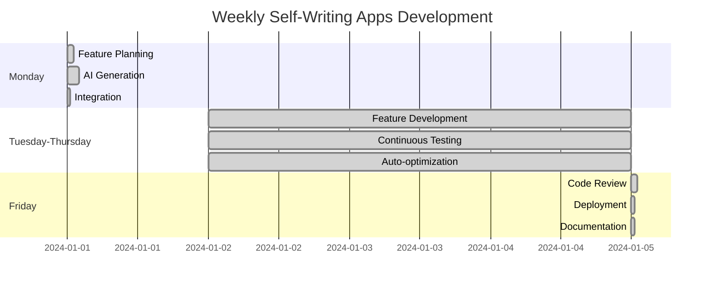

# Self-Writing Apps Workflow

## 🔄 Development Process

Self-Writing Apps transformuje tradycyjny workflow development od manualnego kodowania do AI-first approach. Oto jak wygląda codzienny proces pracy.

## 📊 Evolution Journey: Od Manual do 80% Automated

### Phase 1: Traditional Development (0% Automation)
```
Feature Request → Research → Design → Coding → Testing → Review → Deploy
⏱️ Timeline: 2-4 weeks per feature
👨‍💻 Manual work: 100%
🐛 Bug rate: High
```

### Phase 2: AI-Assisted (30% Automation)
```
Feature Request → AI Assistance → Manual Coding → AI Testing → Manual Review → Deploy
⏱️ Timeline: 1-2 weeks per feature
👨‍💻 Manual work: 70%
🐛 Bug rate: Medium
```

### Phase 3: Self-Writing (80% Automation)
```
Feature Request → AI Generation → Validation → Auto-Integration → Monitoring
⏱️ Timeline: 2-5 days per feature
👨‍💻 Manual work: 20%
🐛 Bug rate: Low
```

## 🚀 Daily Workflow

### Morning Routine (9:00 - 9:30)
```bash
# 1. System Status Check
claude-code status
claude-code analyze-codebase

# 2. Review overnight AI suggestions
claude-code review-suggestions

# 3. Plan today's features
claude-code plan-features --input "features.md"
```

### Feature Development Loop

#### 1. Feature Description (2-5 min)
```markdown
## Feature: User Profile Dashboard

### Description
Dashboard dla użytkownika z:
- Podstawowe informacje (nazwa, email, avatar)
- Statystyki aktywności (last login, actions count)
- Quick actions (edit profile, change password, logout)
- Recent activity feed (last 10 actions)

### Requirements
- Responsive design (mobile-first)
- Real-time updates
- Accessibility (WCAG 2.1)
- Integration z Supabase auth
- TypeScript strict mode

### Acceptance Criteria
- [ ] Wyświetla dane użytkownika
- [ ] Real-time updates without refresh
- [ ] Mobile responsive
- [ ] Loading states
- [ ] Error handling
```

#### 2. AI Generation (5-15 min)
```bash
# Component generation via v0.dev
v0 generate --prompt "User profile dashboard with stats and actions" \
  --style "shadcn/ui" \
  --responsive true

# Business logic via Claude Code
claude-code implement-feature \
  --description "features/user-profile-dashboard.md" \
  --patterns "analyze-existing" \
  --integrate true
```

**Automated Output:**
- `components/UserProfile/Dashboard.tsx`
- `components/UserProfile/StatsCard.tsx`
- `components/UserProfile/QuickActions.tsx`
- `components/UserProfile/ActivityFeed.tsx`
- `hooks/useUserProfile.ts`
- `api/user-profile.ts`
- `types/user-profile.ts`
- `__tests__/UserProfile/Dashboard.test.tsx`

#### 3. Validation & Review (5-10 min)
```typescript
// Auto-generated validation
const validationResult = await claude.validateImplementation({
  feature: 'user-profile-dashboard',
  requirements: requirements,
  codebase: currentCodebase
})

// Review checklist
interface ValidationChecklist {
  ✅ TypeScript compliance: boolean
  ✅ Test coverage: boolean  
  ✅ Accessibility standards: boolean
  ✅ Performance benchmarks: boolean
  ✅ Security best practices: boolean
  ✅ Design system consistency: boolean
}
```

#### 4. Integration (2-5 min)
```bash
# Automatic integration
claude-code integrate \
  --feature "user-profile-dashboard" \
  --update-routes true \
  --update-navigation true \
  --run-tests true
```

**Auto-updates:**
- `app/dashboard/profile/page.tsx` - nowa strona
- `components/Navigation.tsx` - dodanie linku
- `middleware.ts` - auth protection
- `globals.css` - nowe style jeśli potrzebne

#### 5. Quality Assurance (automatyczne)
```bash
# Automated QA pipeline
npm run type-check    # TypeScript validation
npm run lint          # ESLint + Prettier
npm run test          # Jest unit tests
npm run test:e2e      # Playwright integration tests
npm run audit         # Security audit
```

### End of Day (17:00 - 17:30)
```bash
# 1. Generate daily summary
claude-code daily-summary

# 2. Commit & deploy
git add -A
git commit -m "feat: user profile dashboard with real-time stats 🤖"
vercel deploy --prod

# 3. Plan tomorrow
claude-code plan-tomorrow --based-on "today's progress"
```

## 📈 Productivity Metrics

### Traditional vs Self-Writing Comparison

| Metric | Traditional | Self-Writing | Improvement |
|--------|------------|--------------|-------------|
| **Feature Development** | 2-4 weeks | 2-5 days | **5-10x faster** |
| **Code Quality** | Variable | Consistent | **40% fewer bugs** |
| **Testing Coverage** | 60-70% | 85-95% | **25% increase** |
| **Documentation** | Often missing | Auto-generated | **100% coverage** |
| **Code Reviews** | 2-4 hours | 15-30 min | **80% time saving** |
| **Deployment Issues** | 15-20% | 3-5% | **75% reduction** |

### Weekly Development Cycle



## 🔧 Tools Integration

### VS Code Setup
```json
// .vscode/settings.json
{
  "claude-code.enabled": true,
  "claude-code.autoGenerate": true,
  "claude-code.patterns.enabled": true,
  "v0dev.apiKey": "${V0_API_KEY}",
  "files.watcherExclude": {
    "**/ai-generated/**": true
  }
}
```

### Claude Code Configuration
```yaml
# claude.config.yml
patterns:
  enabled: true
  learning: true
  auto-apply: true

generation:
  framework: "nextjs"
  ui-library: "shadcn/ui"
  styling: "tailwind"
  database: "supabase"
  
quality:
  typescript: "strict"
  testing: "jest"
  linting: "eslint"
  formatting: "prettier"

integration:
  auto-commit: false
  auto-deploy: false
  auto-test: true
```

### Project Structure for AI
```
project/
├── .ai-context/           # AI-friendly documentation
│   ├── patterns.json      # Learned patterns
│   ├── conventions.md     # Code conventions
│   └── architecture.md    # System architecture
├── features/              # Feature descriptions
│   ├── user-auth.md
│   ├── dashboard.md
│   └── profile.md
├── ai-generated/          # Generated code staging
└── docs/                  # Auto-updated docs
```

## 🎯 Quality Assurance

### Automated Validation Pipeline

#### 1. Code Quality Gates
```typescript
interface QualityGates {
  typescript: {
    strict: true,
    noImplicitAny: true,
    coverage: 100
  },
  testing: {
    unitTests: 'required',
    integrationTests: 'required', 
    coverage: '>= 85%'
  },
  performance: {
    bundleSize: '< 250kb',
    loadTime: '< 3s',
    lighthouse: '> 90'
  },
  accessibility: {
    wcag: '2.1 AA',
    screenReader: true,
    keyboardNav: true
  }
}
```

#### 2. Security Validation
```bash
# Automated security checks
npm audit                    # Dependencies
snyk test                   # Vulnerability scanning
eslint-plugin-security      # Code security patterns
bandit src/                 # Security linting
```

#### 3. Performance Monitoring
```typescript
// Auto-generated performance tests
describe('UserProfile Performance', () => {
  test('renders in < 100ms', async () => {
    const start = performance.now()
    render(<UserProfile />)
    const end = performance.now()
    expect(end - start).toBeLessThan(100)
  })
  
  test('bundle size < 50kb', () => {
    const bundleSize = getBundleSize('UserProfile')
    expect(bundleSize).toBeLessThan(50000)
  })
})
```

## 🚀 Advanced Workflows

### Multi-Feature Development
```bash
# Parallel feature development
claude-code batch-generate \
  --features "auth,dashboard,profile,settings" \
  --parallel 4 \
  --validate true
```

### Refactoring Workflows
```bash
# AI-powered refactoring
claude-code refactor \
  --target "components/legacy" \
  --to-pattern "modern-hooks" \
  --preserve-behavior true
```

### Bug Fix Automation
```bash
# Automated bug fixing
claude-code fix-bugs \
  --from-issues "github" \
  --auto-test true \
  --create-pr true
```

## 📊 Success Metrics Dashboard

### Real-time Metrics
- **Development Velocity**: Features per week
- **Code Quality Score**: Automated quality assessment
- **Bug Rate**: Bugs per 1000 lines of code
- **Test Coverage**: Percentage coverage
- **Performance Score**: Lighthouse metrics
- **Security Score**: Vulnerability assessment

---

*From manual coding to AI-powered development: The evolution continues.*